<h1 align="center">Hi, I'm Leonardo Muñoz! 👋 </h1>

<h3 align="center">:hammer_and_wrench: Languages and Tools</h3>

  

<picture>
  <source media="(prefers-color-scheme: dark)" srcset="https://raw.githubusercontent.com/LeonardoMV94/LeonardoMV94/output/github-snake-dark.svg" />
  <source media="(prefers-color-scheme: light)" srcset="https://raw.githubusercontent.com/LeonardoMV94/LeonardoMV94/output/github-snake.svg" />
  
</picture>

    <!-- Left Column: Metrics -->
    

        
    

  

        <h3>🌐 Let's Connect and Grow Together!</h3>
        

            
            </a>
        

        
  <!-- <h3>✨ Fun Facts</h3>
        <ul>
            <li>I love Hackathons, Swimming and Tennis.</li>
            <li>I’m on a journey to build a big house in Alaska!</li>
            <li>I enjoy creating content for my YouTube channel, where I share coding tutorials and project walkthroughs.</li>
            <li>In my free time, I explore the beauty of nature and capture it through my photography on Instagram.</li>
        </ul>
        
  <h3>🧑‍💻 About Me</h3>
        

            I'm a passionate software developer with a strong background in cloud computing, game development, and full-stack web development. 
            I have a keen interest in solving complex problems and building scalable solutions. When I'm not coding, you can find me engaged 
            in physical activities like swimming and judo, or planning my next adventure. 
        

        

            My journey in tech has led me to work with various cutting-edge technologies and collaborate with amazing teams across different 
            projects. I’m always eager to learn new things and share my knowledge with the community through my YouTube.
        
 
    
-->

